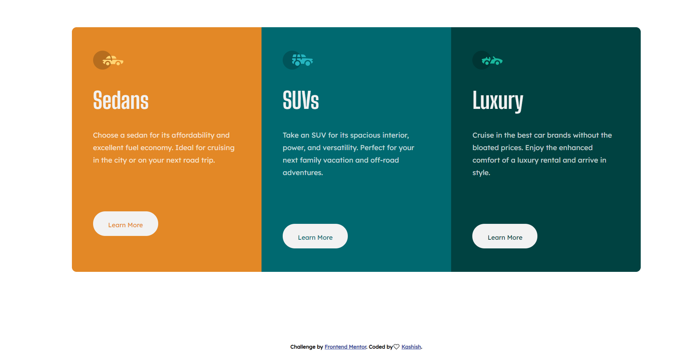

# Frontend Mentor - 3-column preview card component solution

This is a solution to the [3-column preview card component challenge on Frontend Mentor](https://www.frontendmentor.io/challenges/3column-preview-card-component-pH92eAR2-). Frontend Mentor challenges help you improve your coding skills by building realistic projects. 

## Table of contents

- [Overview](#overview)
  - [The challenge](#the-challenge)
  - [Screenshot](#screenshot)
  - [Links](#links)
- [My process](#my-process)
  - [Built with](#built-with)
  - [What I learned](#what-i-learned)
  - [Continued development](#continued-development)
  - [Useful resources](#useful-resources)
- [Author](#author)
- [Acknowledgments](#acknowledgments)

## Overview

### The challenge

Users should be able to:

- View the optimal layout depending on their device's screen size
- See hover states for interactive elements

### Screenshot

### Links

- Solution URL: [Work in progress](https://your-solution-url.com)
- Live Site URL: [Live Site](https://k-ash-ish.github.io/3-column-preview-card-component-main-CHALLENGE/)

## My process

### Built with

- Semantic HTML5 markup
- CSS custom properties
- Flexbox

### Useful resources

- [MDN ](https://developer.mozilla.org/en-US/) - Whenever in doubt I just search things Specially in MDN

## Author

- Website - [Work in progress....](https://www.your-site.com)
- Frontend Mentor - [@K-ash-ish](https://www.frontendmentor.io/profile/K-ash-ish)
- Twitter - [@TwitterKashish](https://twitter.com/Kashish90879490)

## Acknowledgments

